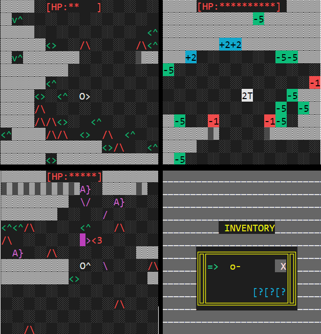

# Roguelike RPG in F#
This is a roguelike written for a programming assignment at the University of Copenhagen.




### Movement
1. ```→``` To the right
2. ```↑``` Upwards
3. ```↓``` Downwards
4. ```←``` To the left

### Turns
1. ```Spacebar``` Shoot turn
2. ```-``` Waits a turn
3. ```I``` Opens an inventory (which is mostly a tech demo and not useful)
4. ```Tab``` Toggles between turn information and graphical view


### Compiling the game

```fsharpc -a roguelike-lib.fs```

```fsharpc -r roguelike-lib.dll roguelike.fsx```

After compiling you can run your application by typing:
```mono roguelike.exe```

### Making a custom map
The worldMap.txt file includes a premade map, which can be modifed and thereafter rendered when running the game. We made it to easily edit the map. The following symbols are parsed corretly:

1. P - represents is the player
2. F - flesh eating plants
3. A - Archers
4. H - Health Potions
5. B - Brute
6. W - Water
7. ! - Fire
8. : - Weak Wall
9. S - Secret
10. X - Exit
11. \# - Walls